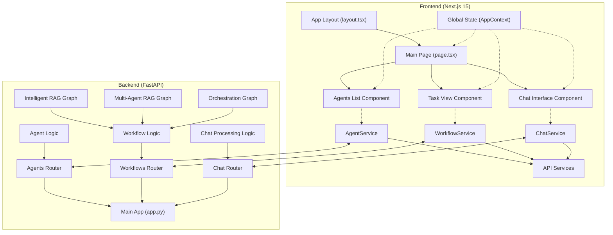
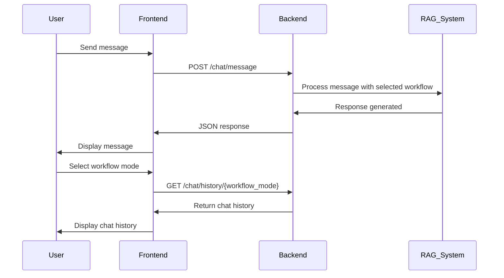

# Sentient Core Architecture

## System Architecture Diagram



## Data Flow



## Component Structure

### Frontend

```
frontend/
├── app/
│   ├── layout.tsx           # Main app layout with ThemeProvider and AppProvider
│   ├── page.tsx             # Main page with tabs for chat, tasks, and agents
│   └── globals.css          # Global styles with Tailwind utilities
├── components/
│   ├── ui/                  # Shadcn UI components
│   ├── theme-toggle.tsx     # Theme toggle component
│   ├── chat-interface.tsx   # Chat interface component
│   ├── task-view.tsx        # Task view component
│   └── agents-list.tsx      # Agents list component
├── lib/
│   ├── api/                 # API services
│   │   ├── agent-service.ts  
│   │   ├── workflow-service.ts
│   │   ├── chat-service.ts
│   │   └── index.ts         # API service exports
│   ├── context/
│   │   └── app-context.tsx  # Global app context
│   └── utils/
│       └── cn.ts            # Class name utility function
└── tests/
    └── chat-interface.test.js # Frontend tests
```

### Backend

```
app/
├── api/
│   ├── app.py              # Main FastAPI application
│   ├── routers/
│   │   ├── agents.py       # Endpoints for agents
│   │   ├── workflows.py    # Endpoints for workflows
│   │   └── chat.py         # Endpoints for chat
└── tests/
    └── test_chat_api.py    # Backend tests
```

## Communication Flow

1. **User Interaction**: User interacts with the Next.js frontend (sending messages, changing workflows)
2. **Frontend Processing**: React components update UI and call appropriate API services
3. **API Request**: API service makes HTTP request to FastAPI backend
4. **Backend Processing**: FastAPI routes request to appropriate handler
5. **RAG System Integration**: Backend integrates with RAG system components (graphs, agents)
6. **Response Flow**: Response flows back through the backend to frontend to user

## Next Steps in Migration

1. Migrate remaining features one by one, following the same pattern
2. Add authentication and authorization
3. Improve error handling and logging
4. Optimize performance with caching and lazy loading
5. Add comprehensive testing coverage
